# Sol Mage

A 3D fantasy RPG that runs in your browser. You start as a new apprentice at Starfall Academy, pick one of six schools of magic, and fight your way through seven lands to the Pale Magister, the Headmaster's brightest former pupil.

| | |
| --- | --- |
| 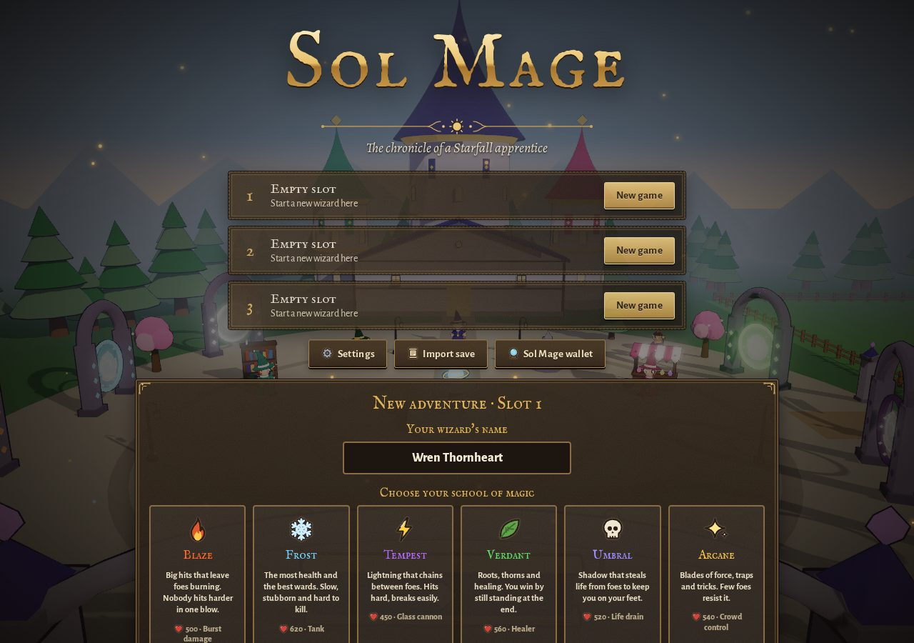 | 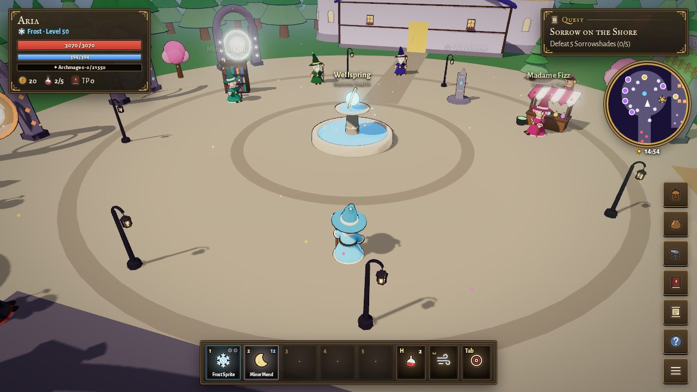 |
| 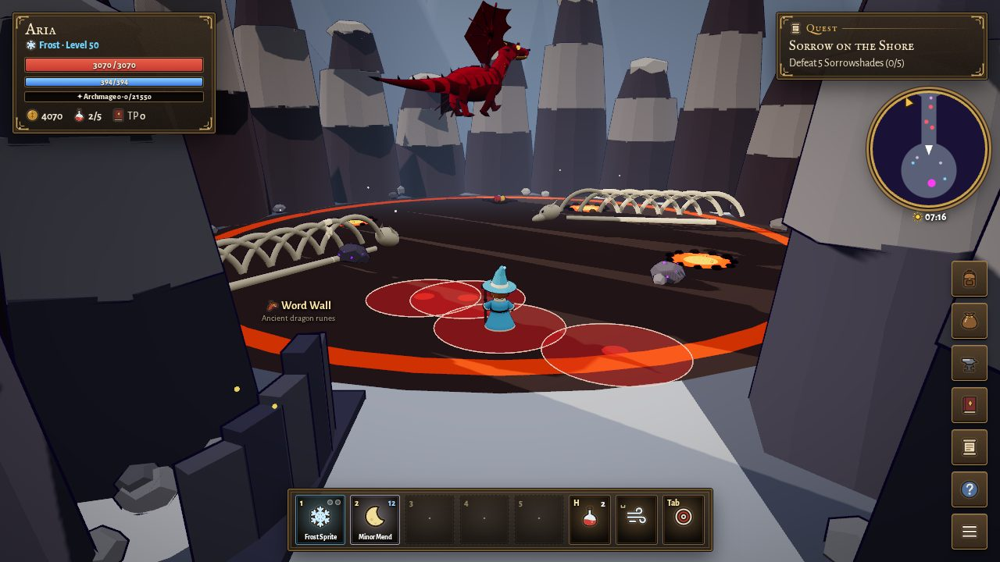 | 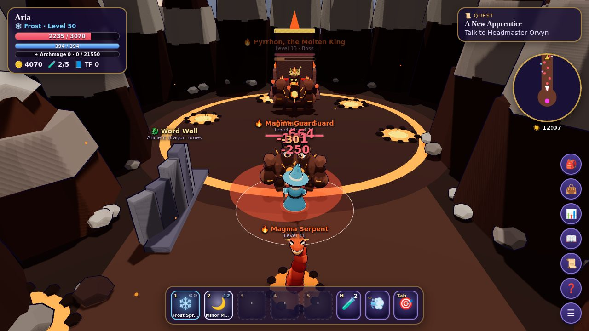 |
| 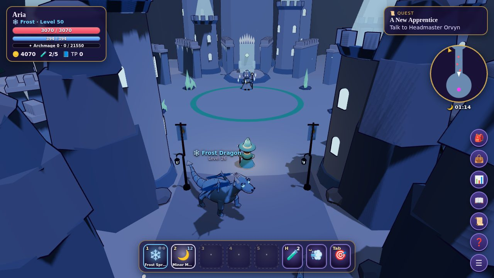 | 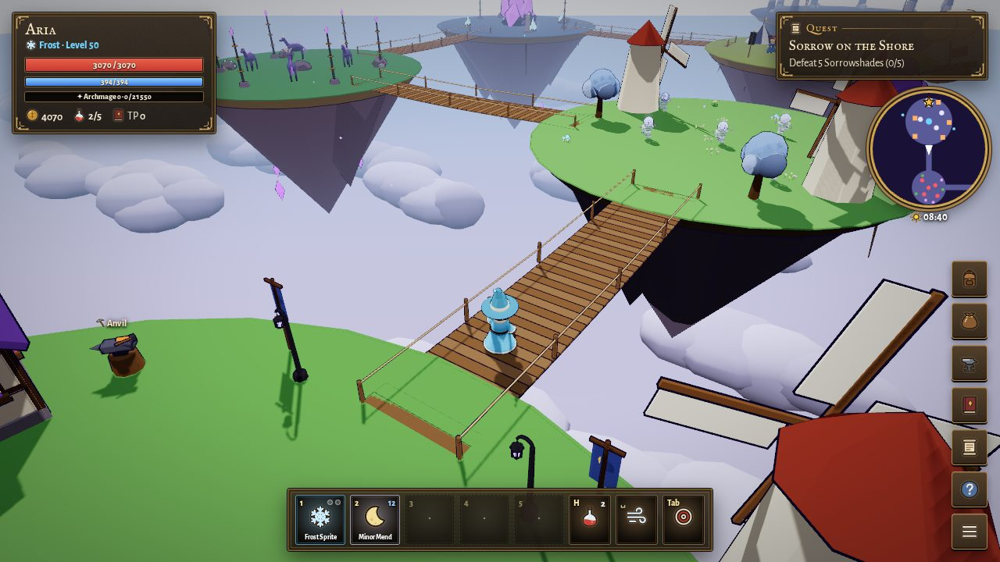 |
| 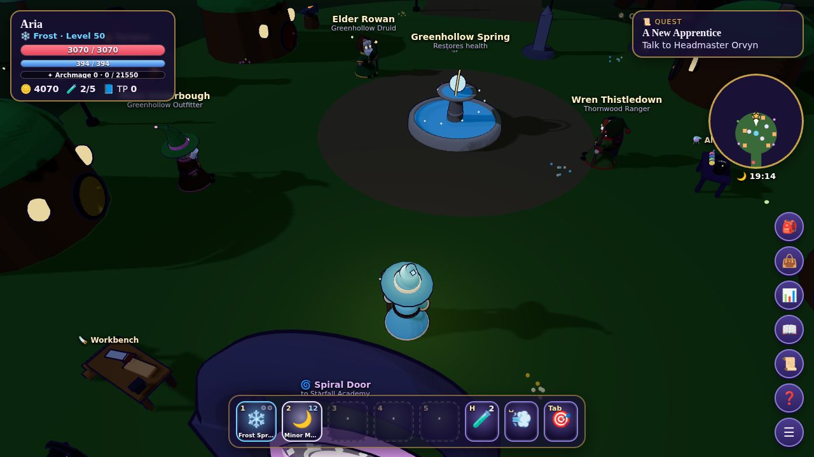 | 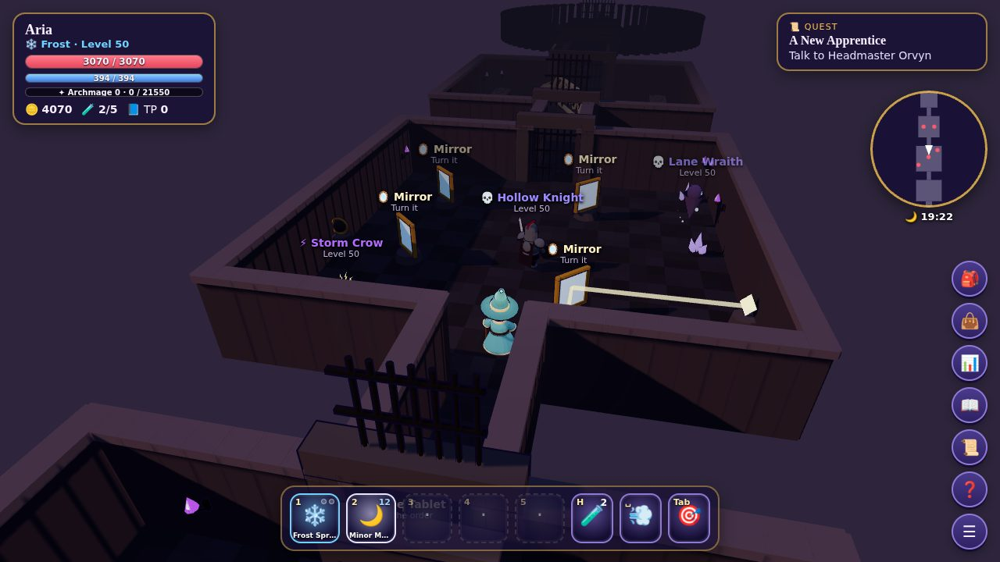 |
| 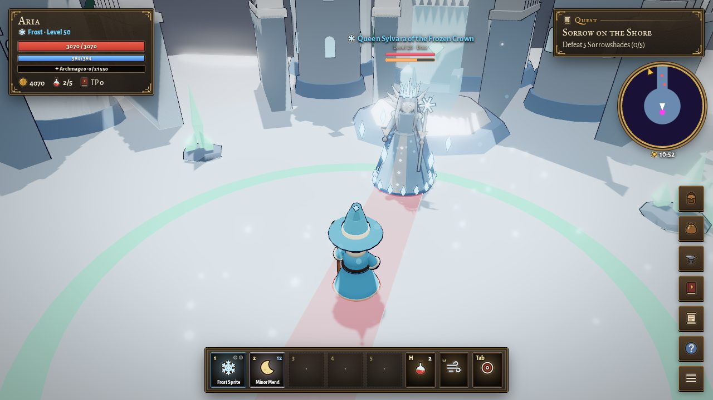 | 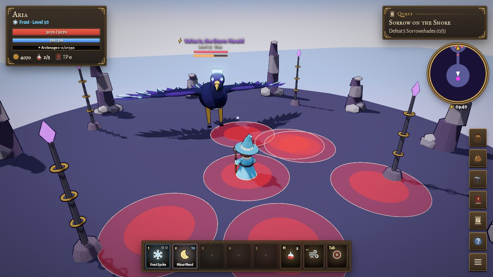 |
| 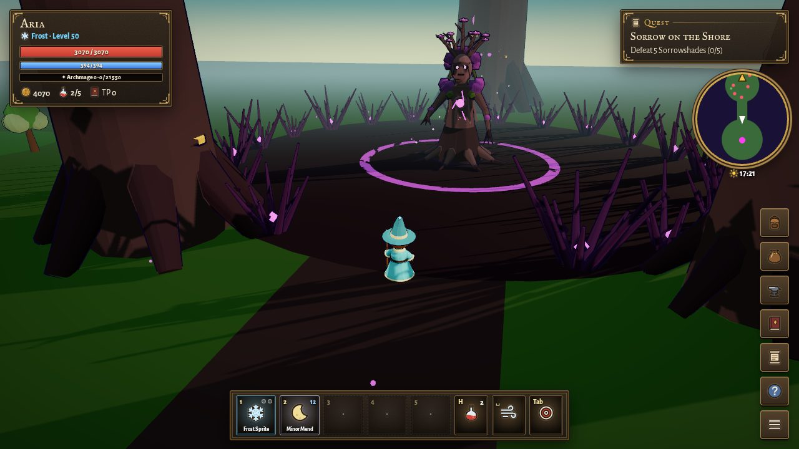 | 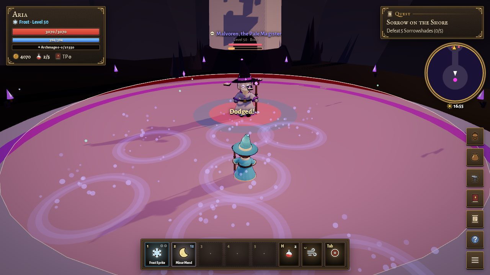 |

## Play it

The game uses JavaScript modules, so it needs a tiny local web server. Opening `index.html` directly won't work. From this folder, run one of these:

```bash
node tests/serve.cjs 8000        # with Node.js (Windows, Mac or Linux)
python3 -m http.server 8000      # or with Python (on Windows: py -m http.server 8000)
```

Then open <http://localhost:8000>. If the port is taken, pick another number (8080, 8001...).

To share it online, turn on **GitHub Pages** for this repo (Settings → Pages → Source: **GitHub Actions**). The workflow in `.github/workflows/pages.yml` publishes the game whenever `main` changes. It's a plain static site with no build step, and it can be installed to a phone's home screen.

## Controls

| Action | Keys |
| --- | --- |
| Move | `W` `A` `S` `D` or the arrow keys, or tap/click the ground |
| Look around | Drag with the mouse or your finger; scroll to zoom |
| Talk / gather / use | `E` |
| Basic attack / spells | `1` / `2`–`5` (or click the hotbar) |
| Dodge | `Space` |
| Dragon shout | `R` |
| Next target | `Tab` (or click an enemy) |
| Spellbook & shouts | `B` |
| Character, gear & pets | `C` |
| Skills | `K` |
| Materials bag | `I` |
| Quest journal | `J` |
| Eat food / drink potion | `F` / `H` |
| Build mode (at your Homestead) | `G` |
| Ride / dismount | `X` |
| World Atlas & fast travel | `N` (or click the minimap) |
| Menu & settings | `Esc` |

Every key can be changed in **Settings → Keys**.

## How it plays

**The story** runs to 51 quests over seven chapters. You clear shadow weeds out of Hollow Lane, then follow the Spiral Doors to the lava fields of Emberfall, the Dragonspire Peaks (where Vorathrax circles overhead until you shout her out of the sky), the snowed-in town of Frostholm, the floating islands of Stormspire, the giant trees of Thornwood, and finally the Hollow Deep. Some quests ask you to thaw frozen lamps, burn cult banners or hold a road against a wolf pack instead of just killing things. You can ask people about the world, and three decisions along the way (what happens to the Frozen Queen, the sky pirates and the Heartwood) change your rewards and the ending.

**Fighting** happens in real time. Key `1` is your school's free basic attack, and keys `2` to `5` hold the spells you choose. Big enemy attacks paint the ground red a moment before they land, so you step out or dodge through. Bosses fly, summon, raise wards and change phases. From Chapter 3 you can learn dragon shouts at Word Walls.

**Between fights** there is plenty to do:

- Nine skills that go to level 99, RuneScape style: mining, woodcutting, fishing, foraging, cooking, smithing, alchemy, woodworking and Slayer.
- The Endless Rift, a roguelike dungeon that changes every run, and the Hollow Undercroft, a hand-built dungeon with puzzles and a Heroic mode.
- A floating Homestead island where you build with crafted blocks.
- Gear in five rarities with 13 sets, talent trees, a second school from level 10, pets that level up, six hireable companions and seven mounts.
- The Arena of Stars, a bestiary, 62 achievements, weekly challenges, and New Game+ after the ending.

**Presentation:** the models are built in code and toon-shaded, with a day and night cycle, weather, bloom and a colour grade for each land. Each land also has its own music, written as chord progressions and melodies and played by a small synthesizer in the page. There are no audio files at all.

**Settings** cover three save slots with export and import, graphics quality, modern or classic controls, rebindable keys, Normal, Heroic and Legendary difficulty, tutorial hints, a colour-blind mode, text size and reduced motion. Phones get a touch joystick.

## Sol Mage token (Solana)

Players can connect a Solana wallet (Phantom, Solflare, Backpack or any Wallet Standard wallet) from the title screen or **Menu → Sol Mage wallet**. The game reads how many Sol Mage (SOLMAGE) tokens the wallet holds and unlocks cosmetic perks for every wizard on that device:

| Hold | Perks |
| --- | --- |
| 1+ | Sol Mage robes (violet and gold), the title "the Sol Mage" |
| 10,000+ | A sun-orange cape and green-fire orb, the title "the Sunbound" |
| 1,000,000+ | Black-and-gold archon robes, a sunfire aura, the title "Solar Archon" |

The game only reads the balance. It never asks a wallet to sign or send anything, the perks give no advantage in battle, and the whole game plays the same without a wallet. It points at **devnet** until launch. [docs/token/README.md](docs/token/README.md) walks through creating the token, testing it with `?solmint=<address>`, and moving to mainnet. The network, mint address and tiers live in `src/chain.js`.

## Code layout

```
index.html        page shell, HUD and title screen
css/style.css     all styling
src/data.js       ⭐ game content: schools, spells, enemies, NPCs, quests (start here to tweak!)
src/items.js      materials, food, potions and tools
src/skills.js     the 8 gathering/crafting skills, resource nodes and recipes
src/sidequests.js side quests (the Gatherers' Guild and more)
src/rift.js       the Endless Rift: floor generation, boons, upgrades
src/dungeon.js    the Hollow Undercroft: puzzles, gates, traps and the Pale Warden
src/shouts.js     dragon shouts
src/homestead.js  building with blocks on your floating island
src/gear.js       item rarities, bonus stats and legendary powers
src/talents.js    talent trees for every school
src/sky.js        day/night cycle and weather
src/achievements.js  the bestiary lore and achievements
src/slayer.js     Slayer tasks
src/companions.js hireable companions
src/arena.js      the Arena of Stars and rival wizards
src/challenges.js weekly challenges
src/lore.js       conversation topics and story choices
src/chain.js      the Sol Mage token: wallet connection, balance lookups and perk tiers
src/ui_wallet.js  the Sol Mage wallet window
src/objectives.js quest objectives beyond fighting: quest objects, ward circles, places to find
src/hints.js      tutorial hint cards
src/settings.js   settings and key bindings
src/state.js      player stats, levelling, quests, save/load
src/world.js      3D world (Three.js): map, movement, camera, enemies, spell effects
src/models.js     toon-shaded models built from code (outlines, faces, merging)
src/combat.js     real-time combat: spells, dodging, enemy AI, pets, boss phases
src/maps.js       Millbrook Meadow, Emberfall, Dragonspire, Glacierreach, Stormspire, Thornwood, the Hollow Deep and the Word Walls
src/skilling.js   the gathering loop
src/ui_*.js       windows for skills, the Rift and shouts
src/minimap.js    corner minimap
src/audio.js      synthesized sound effects, and the music themes with their sequencer
src/ui.js         dialogue, menus, cards
src/icons.js      the icon set: every emoji in the game's text is drawn as an inked SVG icon
src/main.js       ties everything together
lib/              vendored Three.js and its post-processing add-ons (MIT licence), and the fonts (SIL OFL)
tests/            headless playthrough and fuzz tests (see tests/README.md)
gallery.html      model gallery: preview every model (?group=foes1, ?group=frost, ?group=storm, ?group=thorn, ?group=deep, ?model=knight)
.github/workflows GitHub Pages deploy
```

## Roadmap

The full plan is in [ROADMAP.md](ROADMAP.md). In short, each phase ends with a playable build:

1. **Solid foundation:** combat tuning, a settings menu, save slots, a tutorial, and bug and performance fixes.
2. **RPG depth:** talent trees, a second school, gear rarity and set bonuses, crafting, and an economy.
3. **A real world and story:** six worlds (one per school), about 60 main-story quests, branching dialogue, and fast travel.
4. **Dungeons and bosses:** puzzles, elites, dodge-the-floor boss mechanics, and heroic dungeons.
5. **Companions and systems:** hired wizards, pets that level up, mounts, a bestiary, and housing.
6. **Endgame:** level cap 50, the Tower of Trials, an arena, weekly challenges, and New Game+.
7. **Presentation:** animation, per-world music, polish, and accessibility.
8. **Ship it:** publish on GitHub Pages or itch.io and run a playtest round.
9. **Multiplayer (optional):** a small server for towns and co-op dungeons.
